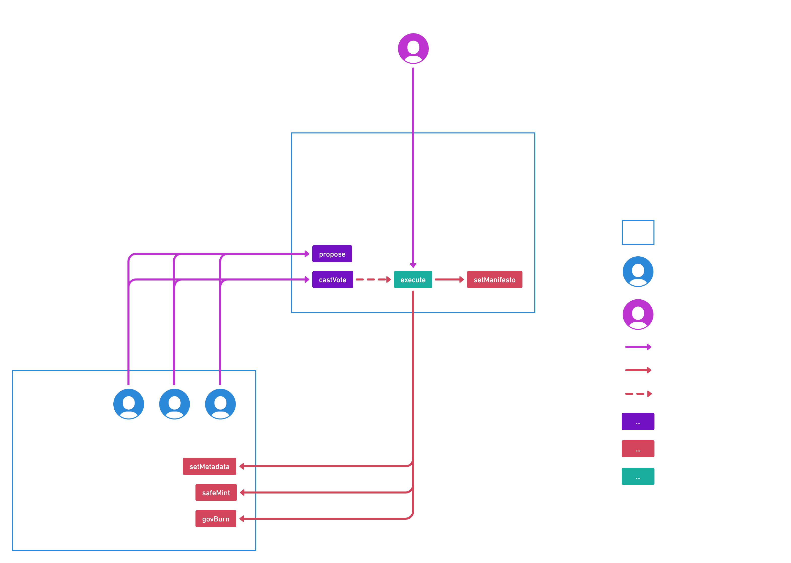

# Solidity contracts

This diagrams describes the interactions between the Gov and NFT contract.



[View on Whimsical](https://whimsical.com/gov-solidity-contracts-explained-54JFEr6Q2BQEG8JvVER5Yq@2Ux7TurymMxL6PifW3WM)

## Gov.sol
```js
// SPDX-License-Identifier: GPL-3.0
pragma solidity ^0.8.0;

import "@openzeppelin/contracts/governance/Governor.sol";
import "@openzeppelin/contracts/governance/extensions/GovernorSettings.sol";
import "@openzeppelin/contracts/governance/extensions/GovernorCountingSimple.sol";
import "@openzeppelin/contracts/governance/extensions/GovernorVotes.sol";
import "@openzeppelin/contracts/governance/extensions/GovernorVotesQuorumFraction.sol";

/// @title DAO contract
/// @author Web3 Hackers Collective
contract Gov is
    Governor,
    GovernorSettings,
    GovernorCountingSimple,
    GovernorVotes,
    GovernorVotesQuorumFraction
{
    string public manifesto;

    event ManifestoUpdated(string cid);

    constructor(
        IVotes _token,
        string memory _manifesto,
        string memory _name,
        uint256 _votingDelay,
        uint256 _votingPeriod,
        uint256 _votingThreshold,
        uint256 _quorum
    )
        Governor(_name)
        GovernorSettings(_votingDelay, _votingPeriod, _votingThreshold)
        GovernorVotes(_token)
        GovernorVotesQuorumFraction(_quorum)
    {
        manifesto = _manifesto;
    }

    function votingDelay()
        public
        view
        override(IGovernor, GovernorSettings)
        returns (uint256)
    {
        return super.votingDelay();
    }

    function votingPeriod()
        public
        view
        override(IGovernor, GovernorSettings)
        returns (uint256)
    {
        return super.votingPeriod();
    }

    function quorum(
        uint256 blockNumber
    )
        public
        view
        override(IGovernor, GovernorVotesQuorumFraction)
        returns (uint256)
    {
        return super.quorum(blockNumber);
    }

    function proposalThreshold()
        public
        view
        override(Governor, GovernorSettings)
        returns (uint256)
    {
        return super.proposalThreshold();
    }

    /// @notice Replaces the CID of the manifesto
    /// @dev Must include the DAO mission statement
    /// @param cid The CID of the new manifesto
    function setManifesto(string memory cid) public onlyGovernance {
        manifesto = cid;
        emit ManifestoUpdated(cid);
    }
}
```
[View on Etherscan](https://goerli.etherscan.io/address/0x90c54A30Ab0CAeBFAaAB4981E165AcCD472a0c3A#code)

## NFT.sol

```js
// SPDX-License-Identifier: GPL-3.0
pragma solidity ^0.8.0;

import "@openzeppelin/contracts/token/ERC721/ERC721.sol";
import "@openzeppelin/contracts/token/ERC721/extensions/ERC721Enumerable.sol";
import "@openzeppelin/contracts/token/ERC721/extensions/ERC721URIStorage.sol";
import "@openzeppelin/contracts/token/ERC721/extensions/ERC721Burnable.sol";
import "@openzeppelin/contracts/access/Ownable.sol";
import "@openzeppelin/contracts/utils/cryptography/draft-EIP712.sol";
import "@openzeppelin/contracts/token/ERC721/extensions/draft-ERC721Votes.sol";
import "@openzeppelin/contracts/utils/Counters.sol";

/// @title DAO Membership NFT contract
/// @author Web3 Hackers Collective
contract NFT is
    ERC721,
    ERC721Enumerable,
    ERC721URIStorage,
    ERC721Burnable,
    Ownable,
    EIP712,
    ERC721Votes
{
    using Counters for Counters.Counter;

    Counters.Counter private _tokenIdCounter;

    constructor(
        address[] memory _firstMembers,
        string memory _uri
    ) ERC721("Membership NFT", "MEMBER") EIP712("Membership NFT", "1") {
        for (uint i; i < _firstMembers.length; i++) {
            safeMint(_firstMembers[i], _uri);
        }
    }

    /// @notice Adds a member
    /// @dev Marked `onlyOwner`: only the Gov contract can access this function
    /// @param to The address of the recipient
    /// @param uri The `tokenURI` of the new member's NFT metadata (should be "ipfs://<CID>")
    function safeMint(address to, string memory uri) public onlyOwner {
        uint256 tokenId = _tokenIdCounter.current();
        _tokenIdCounter.increment();
        _safeMint(to, tokenId);
        _setTokenURI(tokenId, uri);
    }

    function _beforeTokenTransfer(
        address from,
        address to,
        uint256 tokenId,
        uint256 batchSize
    ) internal override(ERC721, ERC721Enumerable) {
        super._beforeTokenTransfer(from, to, tokenId, batchSize);
    }

    function _afterTokenTransfer(
        address from,
        address to,
        uint256 tokenId,
        uint256 batchSize
    ) internal override(ERC721, ERC721Votes) {
        super._afterTokenTransfer(from, to, tokenId, batchSize);
    }

    function _burn(
        uint256 tokenId
    ) internal override(ERC721, ERC721URIStorage) {
        super._burn(tokenId);
    }

    /// @notice Bans a member
    /// @dev Marked `onlyOwner`: only the Gov contract can access this function
    /// @param tokenId The id of the NFT
    function govBurn(uint256 tokenId) public onlyOwner {
        _burn(tokenId);
    }

    function tokenURI(
        uint256 tokenId
    ) public view override(ERC721, ERC721URIStorage) returns (string memory) {
        return super.tokenURI(tokenId);
    }

    /// @notice Replaces the tokenId of a given NFT
    /// @dev Marked `onlyOwner`: only the Gov contract can access this function
    /// @param tokenId The id of the NFT
    /// @param uri The new `tokenURI` for this ID (should be "ipfs://<CID>")
    function setMetadata(uint256 tokenId, string memory uri) public onlyOwner {
        _setTokenURI(tokenId, uri);
    }

    function supportsInterface(
        bytes4 interfaceId
    ) public view override(ERC721, ERC721Enumerable) returns (bool) {
        return super.supportsInterface(interfaceId);
    }
}
```
[View on Etherscan](https://goerli.etherscan.io/address/0xAa15FA49686Ce28085D61bb5f11C0C8208cE3472#code)